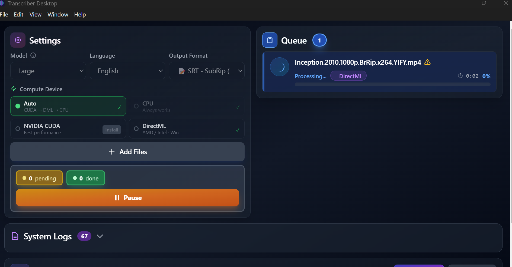

# Transcriber

A desktop application for local audio transcription using OpenAI's Whisper CLI.

## Overview

Transcriber is an Electron-based desktop app that provides an easy-to-use interface for transcribing audio files using Whisper CLI. All processing happens locally on your machine, ensuring complete privacy and offline capability.

Download the latest version [here](https://github.com/andranikarakelyan/transcriber/releases/tag/v1.1.0) | [Changelog](CHANGELOG.md)

## Key Features

- **Local Audio Transcription** - Process audio files entirely on your machine
- **Queue Management** - Add multiple files and process them in a queue
- **Multiple Output Formats** - Support for SRT, VTT, TXT, JSON, and TSV
- **Language Selection** - Choose from 15+ languages or auto-detect
- **Model Selection** - Pick from tiny to large Whisper models based on your needs
- **GPU Acceleration** - CUDA and DirectML support for faster transcription; installable directly from within the app
- **Compute Device Badge** - Each task shows which device (CUDA, DirectML, or CPU) is processing it
- **Real-time Progress** - Live elapsed time per task and detailed transcription logs
- **Overwrite Warning** - Visual warning on queue items when output file already exists
- **Fast Startup** - Loading screen on launch instead of a blank window
- **Privacy-First** - No data leaves your computer

## Platform Support

**Windows only.**

macOS and Linux support has been removed for now to keep the project focused. It may be revisited based on community interest.

## Quick Start

See detailed instructions in [apps/desktop/README.md](apps/desktop/README.md)

## Author

**Andranik Arakelyan**
- Email: andranik.arakelyan.work@gmail.com
- GitHub: [@andranikarakelyan](https://github.com/andranikarakelyan)

## Contributing

This is a public project and **contributions are welcome!** Feel free to:
- Report bugs or issues
- Suggest new features
- Submit pull requests
- Help test on different platforms (macOS, Linux)

## License

This project is licensed under the MIT License - see the [LICENSE](LICENSE) file for details.

## ⚠️ Important Notice

This application was **created using AI agents** to accelerate development. While it has been **manually tested**, there may be edge cases or issues that haven't been discovered yet.

**If you encounter any errors, bugs, or have feature requests, please contact:**
- **Email:** andranik.arakelyan.work@gmail.com
- **GitHub:** [Create an issue](https://github.com/andranikarakelyan/transcriber/issues)
